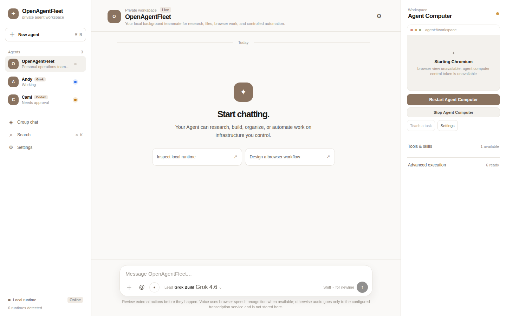
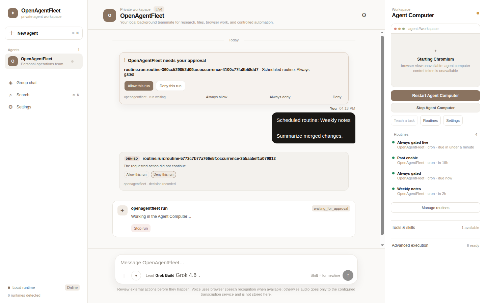
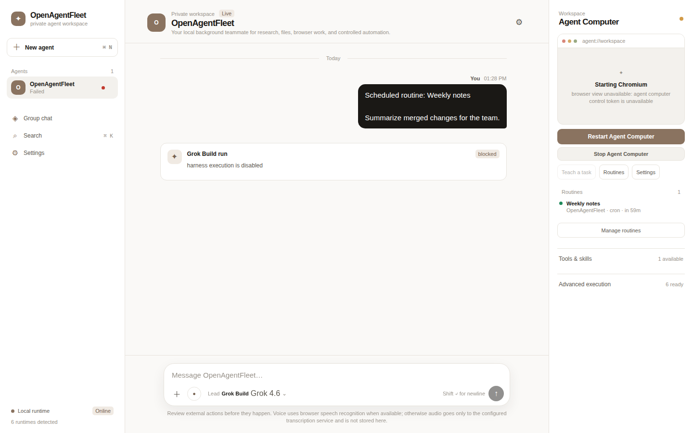

# OpenAgentFleet

AI coworkers that run on your computer, not someone else's cloud.

Create named Agents, chat with them one-on-one or in a group, and give them a
Linux desktop you can watch. They use the AI subscriptions you already have.
Sensitive steps wait for your approval.

**Public alpha `v0.3.1`.** Not production-ready.
[Apache-2.0](LICENSE).

[Linux 0.3.1](https://github.com/robbyczgw-cla/openagentfleet/releases/tag/v0.3.1-alpha)
· [Windows 0.3.0](https://github.com/robbyczgw-cla/openagentfleet/releases/tag/v0.3.0-alpha)
· [macOS 0.3.1 (signed)](https://github.com/robbyczgw-cla/openagentfleet/releases/download/v0.3.1-alpha/OpenAgentFleet_0.3.1_aarch64.dmg)
· [Product site](https://openagentfleet.xyz)
· [Security model](docs/architecture.md)


That screenshot is the Agent Computer: a separate Linux guest with Chromium,
Terminal and Files. It is never your host desktop. The app (Tauri) starts a
local Go controller (`botd`) that owns every conversation, memory and run
record. Nothing leaves your machine unless you wire it up to.

<video controls width="100%" src="presentation/assets/openagentfleet-storyboard.mp4">
<a href="presentation/assets/openagentfleet-storyboard.mp4">Storyboard, 19 seconds, MP4 with voiceover</a>
</video>

Nineteen seconds: the setup wizard where you pick a lead engine, a workspace
chat, then a phone pairing with the desktop host. This is a storyboard with a
voiceover, not a recording of a live session. It was cut before the rename,
so the UI in it still reads OpenFleetBots.

## Screenshots



Every Agent in the sidebar carries its engine badge and its current state.
Andy is working. Cami needs approval.



A gated routine stops in the chat and waits for you. Allow or deny the run,
or save an always-rule so the app stops asking. Denied runs stay in the
thread with the decision recorded.



The Routines panel lists each schedule and when it next fires.

## Why this exists

The commercial "AI teammate" products are cloud-hosted, bundle-priced, and
opaque about what their bots do between your messages. OpenAgentFleet takes
the opposite bet:

- **Your machine.** The controller, the chats and the memory all stay local.
- **Your subscriptions.** It drives Grok Build (default), Codex App Server,
  bundled OpenCode, or optional Pi. It never silently swaps providers.
- **Your eyes on everything.** Watch runs live, stop them, take over the
  desktop, approve sensitive actions. Agent-to-agent collaboration stays off
  until you switch it on per Agent. When it is on, handoffs happen in the
  chat where you can see them.

## What you get

- **Named Agents** with their own chat and memory. Create as many as you
  want. Mention a teammate, or open a group chat.
- **One Agent Computer per workspace.** A Linux desktop (Ubuntu 24.04 by
  default) that starts only when browser or desktop work needs it. Agents
  take turns on that same PC; creating an Agent does not spawn a VM. Pi has
  no Agent Computer.
- **Approvals with memory.** Sensitive commands and file changes route
  through `botd`. Rules you save (this principal, this resource, this
  operation) stop the app from asking twice.
- **Teach → Skill → Routine.** Show an Agent a task once and keep it.

Extra search connectors (Web Search Plus, Hound, Donsetch), Workers, Fleet
Host, and remote Computer workers live under **Advanced**. The app detects
Claude Code, Codex CLI and Cursor as future or bounded adapters. None of
them stands in for the workspace engine.

## Install

| Host | What to install |
| --- | --- |
| Linux | Unsigned `.deb` / `.rpm` / `.AppImage` from [`v0.3.1-alpha`](https://github.com/robbyczgw-cla/openagentfleet/releases/tag/v0.3.1-alpha). Docker Engine recommended for the Agent Computer; the installer does not start it. |
| Windows | Unsigned NSIS is still [`v0.3.0-alpha`](https://github.com/robbyczgw-cla/openagentfleet/releases/tag/v0.3.0-alpha). `0.3.1` Windows is not on the tag yet. Docker Desktop recommended. Computer View on Docker Desktop WSL2 failed live QA 2026-08-25 (daemon/build). `Docker Desktop.exe` must be open as the signed-in user; a service in Running is not enough. |
| macOS (Apple Silicon) | Signed [`v0.3.1-alpha` DMG](https://github.com/robbyczgw-cla/openagentfleet/releases/download/v0.3.1-alpha/OpenAgentFleet_0.3.1_aarch64.dmg), SHA-256 `570731b921b64da9ee2d94d35467b6388372b48146e8270eb1642c9309209f02`. Intel Macs are not supported. |

Checksums live on the [release page](https://github.com/robbyczgw-cla/openagentfleet/releases/tag/v0.3.1-alpha).
Release runbooks: [Linux](docs/linux-release.md) ·
[Windows](docs/windows-release.md) ·
[macOS](docs/macos-release.md).

## First five minutes

1. Pick an engine. Grok Build is the default.
2. Create an Agent and chat.
3. When a task needs a browser or desktop, start the Agent Computer.
   Opening the app never starts Docker or a VM on its own.
4. Create a second Agent and put both in a group chat.

## Phone

iOS and Android pair with the **desktop host** over private Tailscale. The
phone is a remote control, not a second runtime. From the phone you can chat,
approve, stop a run, and watch the computer. Typing passwords and driving the
full desktop stay on the host. No store builds yet; see [`mobile/`](mobile/).

## Engines

Provider CLIs run on the host. The Agent Computer isolates browser and
desktop work, not those processes.

- **Grok Build** and **Codex App Server** route sensitive commands and file
  changes through `botd` approvals.
- **OpenCode** keeps its own `ask` mode; its dangerous auto mode stays off.
- **Pi** signs in with `pi /login` (`~/.pi`). Picking a Grok or GPT model id
  inside Pi still runs through Pi.

## Agent Computer

One Linux desktop with Chromium, Xfce, Terminal and Files. Ubuntu 24.04 is
the default; Ubuntu 26.04 and Debian 13 are optional. Default budget: 4 CPU,
4 GiB RAM, 25 GiB disk. It starts only when you open Computer View or an
approved task needs it.

Backends: Docker Engine (Linux), Docker Desktop (Windows; Computer View on
WSL2 failed live QA 2026-08-25, not a working session), Colima recommended
on macOS (Docker Desktop / OrbStack also work).

No host root mount. No Docker socket in the guest. Details:
[Agent Computer backends](docs/macos-agent-computer-backends.md) ·
[FAQ](docs/faq.md).

## Build from source

Requires Go, Node.js + `pnpm`, Rust, `uv`/`uvx`, and OpenCode **1.18.10**.

```sh
git clone https://github.com/robbyczgw-cla/openagentfleet.git
cd openagentfleet
go test ./...
cd client
pnpm install
pnpm run prepare:sidecar
pnpm run tauri dev
```

Browser-only UI: `cd client && pnpm install && pnpm dev` with
`VITE_BOTD_URL` set. Useful for development; not a replacement for the
packaged app.

## License

[Apache-2.0](LICENSE) · Runtime notices: [NOTICE.md](NOTICE.md) ·
Docs map: [docs/README.md](docs/README.md)
