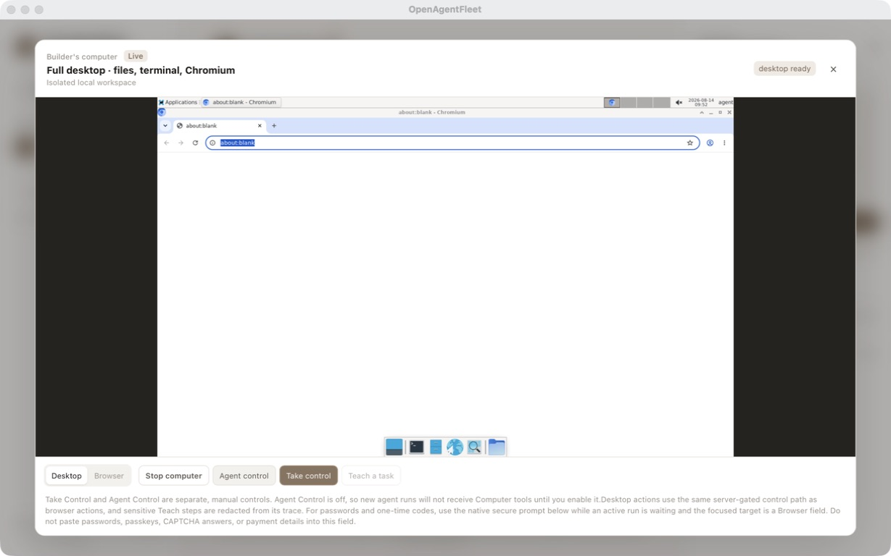

# OpenAgentFleet

> **Run AI agents on your Mac with explicit control.**

Use Grok Build, Codex App Server, bundled OpenCode, or optional Pi in one
local workspace. For browser and desktop tasks, engines that actually receive
Computer MCP get an isolated Linux computer you can watch, stop, or take over.

**Open-source public alpha.** The Mac-first runtime is real and tested, but
OpenAgentFleet is not feature-complete or production-ready. Provider login,
model availability, macOS permissions, and local runtime setup depend on your
machine. The project is independent and licensed under [Apache-2.0](LICENSE).

[Download the macOS alpha](https://github.com/robbyczgw-cla/openagentfleet/releases/download/v0.1.0-alpha/OpenAgentFleet_0.1.0_aarch64.dmg) ·
[Visit the product site](https://openagentfleet.xyz) ·
[Read the security model](docs/architecture.md)



This preview shows the shared client running in a browser during development.
The macOS product wraps the same React UI in a native Tauri window and starts
the local Go controller automatically.

## What you can do today

- Use Grok Build (the default), Codex App Server, bundled OpenCode, or
  optional Pi in one local workspace.
- Give browser and desktop tasks a separate local Linux computer with
  Chromium, Terminal and Files, when the selected engine receives Computer
  MCP. Pi does not.
- Watch the work live, stop it, take control, and approve sensitive actions.
- Keep conversations, memory, transcripts and run artifacts in the local
  controller.
- Attach files and images, drag them into chat, and use dictation when the
  selected client and provider support it.

### Advanced and experimental

These capabilities are available for users who need them, but are not required
to understand or use the core product:

- bounded workers below the primary AI engine;
- native search, Web Search Plus MCP and Hound MCP connectors;
- Colima, Docker Desktop, OrbStack and optional remote Computer workers;
- routines, heartbeat runs, plugins, skills and mobile control over Tailscale.

Claude Code, Codex CLI and Cursor remain detected as future or bounded
worker adapters where their permission contract is not yet fully
enforceable. Pi is no longer in that set: it is an optional workspace
engine and an optional bounded worker. The product never silently
substitutes a different provider.

## Current provider boundaries

Provider CLIs and harnesses currently run directly on your Mac; the isolated
Agent Computer is the boundary for browser and desktop work, not full
provider-process isolation. What "explicit control" means today depends on
the engine:

- **Grok Build** and **Codex App Server** can use controller-brokered
  approvals: sensitive commands and file changes are routed through `botd`
  and surfaced as visible approval requests before they run.
- **Bundled OpenCode** keeps its own default permission handling (its safe
  `ask` mode; its dangerous auto mode is disabled). It does not go through
  the controller's approval broker, and the UI labels it accordingly.
- **Pi** is opt-in. Install the `pi` CLI and sign in with `pi /login`
  (credentials stay in `~/.pi`). A Pi lead is `pi --mode rpc --no-session`
  with `--tools`. Memory stays OpenAgentFleet-owned. Pi has no MCP
  injection, so Hound, Web Search Plus, and the Agent Computer are
  unavailable. Lead `ask` confirms through a bundled Pi extension and RPC
  `extension_ui`, not a native OpenAgentFleet popup. Picking `xai/grok-4.3`
  or `openai/gpt-5.5` in the Pi picker still runs **through Pi**, not as
  Grok Build or Codex App Server.

## Download

`v0.1.0-alpha` is a signed and notarized DMG for Apple Silicon Macs:

[**OpenAgentFleet_0.1.0_aarch64.dmg**](https://github.com/robbyczgw-cla/openagentfleet/releases/download/v0.1.0-alpha/OpenAgentFleet_0.1.0_aarch64.dmg)

Checksums and release notes are on the
[v0.1.0-alpha release page](https://github.com/robbyczgw-cla/openagentfleet/releases/tag/v0.1.0-alpha).
Intel Macs are not supported yet. If you would rather build it yourself, or you
want to contribute, use [the source build](#build-from-source).

## Build from source

Building from source is the contributor path; you do not need it to run the
alpha. The current supported target is Apple Silicon macOS. The native Tauri
build requires Go, Node.js with `pnpm`, Rust with the macOS build tools, `uv`,
`uvx`, and OpenCode exactly at version `1.18.10`. The sidecar preparation step
packages `botd`, the Agent Computer MCP, Web Search Plus launchers, and the
bundled OpenCode worker, so these are required for the current full build
path, not optional provider tools.

Provider logins and provider-specific CLIs remain optional according to the
engine you choose. A Docker-compatible runtime is only needed when you start
the Agent Computer; Colima is the recommended option.

```sh
git clone https://github.com/robbyczgw-cla/openagentfleet.git
cd openagentfleet

go test ./...

cd client
pnpm install
pnpm run prepare:sidecar
pnpm run tauri dev
```

To inspect only the shared browser client without building native sidecars:

```sh
cd client
pnpm install
pnpm dev
```

That browser mode is a development and remote-client surface, not a
replacement for the packaged macOS app. It can target a controller with
`VITE_BOTD_URL` and `VITE_BOTD_TOKEN`; native Tauri-only capabilities remain
available only in the app shell.

The packaged client starts its local Go controller automatically. Provider
OAuth and API keys stay with the provider or local CLI that owns them; the
controller does not copy them into chat messages or its SQLite store.

## First run

1. Choose an available AI engine. Grok Build is the default. OpenCode uses
   its local provider configuration. Pi needs the `pi` CLI and `pi /login`.
2. Create the first Agent and start chatting.
3. Add computer access, search connectors and stricter permissions only when
   you need them.

Model, reasoning, service tier, workers and detailed permissions remain
editable in Agent Builder and Settings; they are deliberately not required
for the first conversation.

The Agent Computer is lazy. Opening the app, creating an Agent, or selecting a
provider does not start a VM, container, Chromium session or harness run.
Computer View starts the selected local runtime only when you explicitly open
it or an approved task needs browser/desktop work.

### Colima first start

Colima is the recommended open-source macOS route. On the first Computer start,
OpenAgentFleet automatically:

1. creates the private Agent workspace;
2. creates a durable Docker-managed Chromium profile volume inside the
   dedicated runtime, so Chromium's POSIX lock files do not cross the macOS
   virtiofs boundary;
3. adds only the workspace to the dedicated `openagentfleet` Colima profile as
   a writable mount;
4. preserves unrelated profile mounts and restarts only that dedicated profile
   when its configuration changed; and
5. starts Chromium, Xfce, Terminal and Files only after Docker is ready.

If Colima or Docker is missing, the app shows the install command and a retry
path. Docker Desktop and other Docker-compatible contexts remain optional
fallbacks. OpenAgentFleet never mounts the host root, silently changes the
default Colima profile, or exposes the Docker socket to the Agent Computer.

## How it works

```text
Tauri macOS app / mobile client
              |
       authenticated local API
              |
            botd
        /      |       \
     Agent   Lead   Computer
    memory  harness  runtime
              |
     bounded optional workers
```

- **Agent** is the user-facing identity. It owns the role, system context,
  memory, enabled tools and computer policy. One Agent and one chat is the
  default; extra conversations are optional.
- **AI engine (Lead)** is the selected primary harness for a run. Current lead
  routes are Grok Build, Codex App Server, bundled OpenCode, and optional Pi.
  “Lead” is the architecture term; the simple user-facing choice is the AI
  engine.
- **Worker** is a bounded helper below the Lead. It receives a task slice,
  explicit model/reasoning/budget/permissions and no hidden credentials.
- **`botd`** is the local authority. It resolves configuration, applies the
  capability broker, asks for approvals, injects the approved Computer MCP,
  records events and revokes run capabilities.
- **Agent Computer** is a separate Linux execution surface. It is not the
  Lead, not a second Agent and not a replacement for the controller.

Read the detailed [Agent model](docs/agent-model.md),
[Lead/Worker architecture](docs/lead-worker-architecture.md), and
[architecture overview](docs/architecture.md) for the full contracts.

## The Agent Computer

The shipped computer image is a non-root Linux desktop with Chromium, Xfce,
Terminal and Files. The controller exposes authenticated browser and desktop
frames/actions instead of raw VNC or noVNC. Chromium CDP stays inside the
computer; only the narrow view-service port is published to loopback on the
Mac.

Sensitive browser passwords and one-time codes use a native macOS secure
handoff during an explicit takeover. They do not enter the chat composer,
React state, Teach recordings or model context. CAPTCHA, payment and desktop
credential entry remain manual or unsupported by this narrow path.

The standard Agent Computer uses Ubuntu 24.04 with 4 CPU, 4 GiB RAM, a 25 GiB
disk and 1 GiB guest swap. Ubuntu 26.04 and Debian 13 are available as
optional images, and the CPU, RAM, disk and swap values can be adjusted in
Settings. See the [Agent Computer FAQ](docs/faq.md) for runtime-specific
resource behavior.

The computer can run through:

- **Colima + Docker** — recommended open-source macOS default;
- **Docker Desktop** — supported compatibility fallback;
- **OrbStack or another Docker context** — optional when already configured;
- **remote Agent Computer** — an optional second Mac/Linux host reached over
  an authenticated private network.

Apple Container and Lume are documented experimental/future backends. They are
not presented as working Computer providers until they pass the same Chromium,
desktop-frame, takeover and approval acceptance suite.

## Search, MCP and plugins

Native search stays available to AI engines that support it. Web Search Plus
and Hound are independent optional MCP connectors with visible per-Agent
configuration and credentials. Connector IDs are validated before a run and
their provenance is recorded in [NOTICE.md](NOTICE.md).

The plugin and skill surfaces are deliberately capability-brokered. An Agent
does not receive arbitrary host applications, folders, browser profiles,
network access or provider keys merely because a connector exists.

## Remote phone access

The Mac remains the execution host. iOS and Android clients are remote clients
of the durable Mac controller; they do not run Docker, browser sessions or
provider CLIs locally. Pair them over Tailscale or another private network,
keep `botd` on loopback, and expose it through an authenticated private route.

See [mobile remote](docs/mobile-remote.md),
[remote Mac architecture](docs/remote-mac-architecture.md), and
[remote Computer worker](docs/remote-computer-worker.md).

## Security model

The default boundary is local-first, explicit and observable:

- provider inference may be remote, but controller state and Computer
  lifecycle remain on the user's Mac;
- provider CLIs and harnesses run as normal macOS processes; the Agent
  Computer isolates browser and desktop work, not provider processes;
- only the approved workspace is mounted from macOS; browser state stays in a
  private Docker volume owned by the local runtime;
- the Computer image is non-root and receives no Docker socket;
- browser and desktop input are bounded and server-gated;
- takeover, sensitive handoff and worker permissions are explicit;
- run events, approvals, transcripts and artifacts are durable and auditable;
- remote access is private and token-authenticated rather than a public bind.

This is a product boundary, not a claim that a malicious process already
running as the same macOS user can never inspect transient memory.

## Development and verification

The fast local gates are:

```sh
go test ./...
go vet ./...
go test -race ./internal/compute ./internal/httpapi ./internal/browsermcp -count=1
pnpm --dir client exec tsc --noEmit
pnpm --dir client exec vite build
cargo test --manifest-path client/src-tauri/Cargo.toml --locked
cargo fmt --manifest-path client/src-tauri/Cargo.toml --check
git diff --check
```

CI proves code-level contracts. It does not prove that a provider is logged
in, a real Colima VM is healthy, a macOS permission prompt was accepted, or a
physical phone is paired. Use the [fresh-user smoke checklist](docs/fresh-user-smoke-test.md)
and record live Computer, OAuth, mobile and signing evidence separately.

For local host installation and private Tailscale access, see
[macOS host lifecycle](docs/mac-host-install.md). For the documentation map,
see [docs/README.md](docs/README.md).

## Alpha status and roadmap

The current slice focuses on a trustworthy local Mac runtime: one-Agent chat,
model selection, durable memory/transcripts, attachments, native dictation
plumbing, visible approvals, a real Chromium/Xfce Computer, optional bounded
workers, MCP connectors, and a remote-client contract.

Remaining work includes broader provider adapters, universal worker
isolation, production skill/plugin lifecycle, richer routines and heartbeat
execution, native mobile releases, Intel Mac support, and complete product
parity. The honest current-vs-planned boundary lives in the
[Grok Build parity contract](docs/grok-build-parity.md), the QA runbooks and
the architecture documents.

## License

OpenAgentFleet is licensed under [Apache-2.0](LICENSE). [NOTICE.md](NOTICE.md)
contains only the runtime license notices needed for components that may be
bundled or explicitly launched; OpenAgentFleet's product, UI and documentation
stand on their own.
